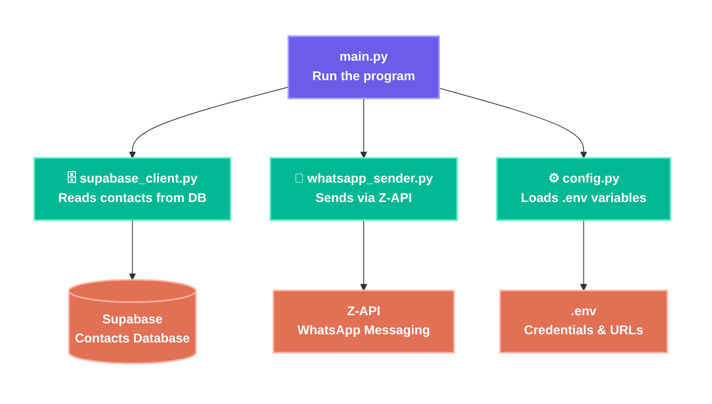

## Arquitetura
Cada módulo tem uma única responsabilidade (princípio SRP do SOLID):
- `config.py` não sabe nada de WhatsApp ou Supabase, só lida com variáveis de ambiente
- `supabase_client.py` não sabe nada de envio, só busca dados
- `whatsapp_sender.py` não sabe nada do banco, só envia mensagens
- `main.py` não tem lógica de negócio, só orquestra os outros módulos